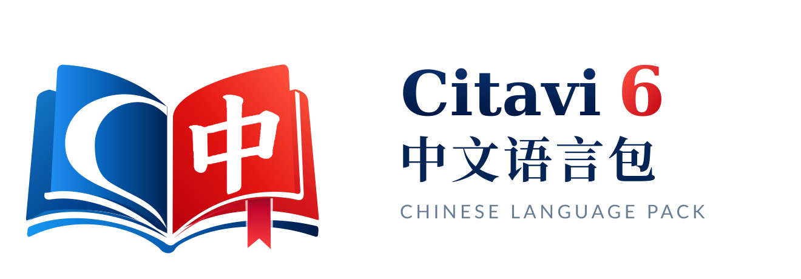
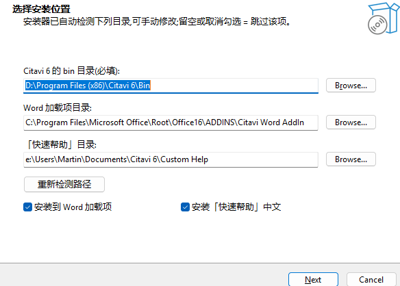

<div align="center">



**让文献工具更懂中文**

</div>

# Citavi 6 中文语言包 (zh)

[](https://github.com/Martin-soaring-dev/citavi6_language_add-on_zh/releases/latest)
[](#)
[](#)
[](LICENSE)
[](https://github.com/Martin-soaring-dev/citavi6_language_add-on_zh/actions/workflows/validate.yml)

为 **Citavi 6**(Windows 桌面版,瑞士学术软件 / Lumivero)提供的**简体中文界面语言包**,外加
**「快速帮助」中文**与 **Word 加载项中文**。**不改动 Citavi 任何原始文件**。

> **想直接用?** 到 [最新 Release](https://github.com/Martin-soaring-dev/citavi6_language_add-on_zh/releases/latest)
> 下载 `Citavi6-zh-Setup-*.exe` → 双击安装 → 重启 Citavi → 「工具 → 语言」选「中文」。完成。

---

## ✨ 亮点

- **界面中文化** —— 7 个附属程序集、52 个资源组、**11,612** 条字符串。
- **快速帮助中文化** —— 右侧帮助面板 **622** 个主题,含「选择文献类型」按 35 种文献类型变化的帮助。
- **Word 加载项中文化** —— 让 Word 里的 Citavi 加载项也显示中文。
- **一键安装程序** —— 自动探测路径、可勾选组件、带「应用和功能」卸载项,不修改 Citavi 原文件;
  安装程序自带项目图标与品牌向导页(图形安装器同样带徽标)。
- **可脚本/静默部署** —— 提供 PowerShell 脚本与 `/VERYSILENT` 静默安装。

## 🚀 快速开始

| 步骤 | 操作 |
|---|---|
| 1 | 到 [Releases](https://github.com/Martin-soaring-dev/citavi6_language_add-on_zh/releases/latest) 下载 **`Citavi6-zh-Setup-*.exe`** |
| 2 | 双击运行 →(UAC 授权)→ 确认自动探测到的路径 → 安装 |
| 3 | **重启 Citavi** → 菜单 **「工具 → 语言」** → 选择 **「中文」** |
| 4 | 如需 Word 加载项中文:**重启 Word** |

> 只想装界面的最小方案:下载 ZIP,把里面的 `zh` 文件夹复制到 `…\Citavi 6\bin\zh\` 即可(见下文方式 C)。

---

## 📦 安装方式

### 方式 A —— 安装程序(最推荐)



下载 `Citavi6-zh-Setup-<版本>.exe` 双击运行:

- 启动即**请求管理员权限**(写入 Citavi / Word 加载项的 `Program Files` 目录需要)。
- **自动探测** Citavi 6、Word 加载项、「快速帮助」目录,可在页面上手动修改或点「重新检测路径」。
- 用复选框选择是否安装到 **Word 加载项** / 是否安装 **「快速帮助」**;取消勾选或留空即**跳过**该项。
- 安装后在 Windows「**应用和功能**」里生成**卸载项**。

静默部署(可选):

```powershell
Citavi6-zh-Setup-v0.103.exe /VERYSILENT
# 覆盖目录(可选):/CITAVIBIN=  /WORDBIN=  /HELPDIR=
```

### 方式 B —— ZIP + 脚本

解压 ZIP 后双击 **`安装.vbs`**(图形界面,无控制台):

- 启动即请求管理员权限;自动检测目录、**预览计划**、冲突进程弹窗提示(名称+PID),再覆盖安装语言包与快速帮助。

```powershell
pwsh ./Install-Toolkit.ps1 -WhatIf                         # 只预览,不执行
pwsh ./Install-Toolkit.ps1 -CitaviBin "…\Citavi 6\bin"     # 手动指定路径
```

### 方式 C —— 手动 / 命令行

1. 把 `dist/zh/`(或 ZIP 里的 `zh`)复制到 Citavi 安装目录的 `bin\` 下:

   ```
   C:\Program Files (x86)\Citavi 6\bin\zh\
   ```

2. *(可选,Word 加载项)* 把同一个 `zh` 再复制到 Word 加载项目录:

   ```
   C:\Program Files\Microsoft Office\Root\Office16\ADDINS\Citavi Word AddIn\zh\
   ```

   > 该目录由 Citavi 安装程序创建;不存在可忽略此步(重启 Word 生效)。

3. 启动 Citavi → **工具 → 语言 → 中文**;若未生效,重启 Citavi。

```powershell
# 等价命令行
pwsh ./tools/Install-LanguagePack.ps1 -CitaviBin "C:\Program Files (x86)\Citavi 6\bin"
```

### 卸载

- **安装程序装法**:在 Windows「应用和功能」中卸载(会自动清理 `zh` 目录与快速帮助),或在安装程序里点「卸载」。
- **手动装法**:删除 `bin\zh\` 目录,并在「工具 → 语言」里切回其他语言。

---

## ✅ 支持与限制

| 项目 | 说明 |
|---|---|
| 支持版本 | Citavi 6.x(基于 6.20 开发) |
| 目标语言 | 简体中文(`zh`,菜单显示为「中文」) |
| 覆盖范围 | 7 个程序集(含 Word 加载项)、52 个资源组、**11,612** 条字符串 + **622** 条「快速帮助」;未翻译条目自动回退英文 |
| 不修改原程序 | ✅ 仅新增 `bin\zh\` 目录与 `文档\Citavi 6\Custom Help` |
| Citavi 版本 | 基于 **6.20** 开发;官方已停止更新,不预期再有新增词条 |
| 动态/联网帮助 | 少数对话框(**按 ID 检索、查找馆藏位置、引文样式**等)运行时**直接联网**取帮助,官方无中文,语言包无法覆盖 → 保持英文(详见 [docs/05](docs/05-language-pack-backlog.md)) |

> 注:语言目录名必须形如 `xx` 或 `xx-XX`,**不能**用 `zh-Hans`,故本项目使用 `zh`。

## 🧩 项目构成

| 组件 | 作用 | 状态 |
|---|---|---|
| **语言包** | Citavi 6 界面简体中文(仓库主体) | ✅ |
| **「快速帮助」中文** | 汉化右侧帮助面板(622 个主题,写入 `文档\Citavi 6\Custom Help`) | ✅ |
| **Word 加载项中文** | 汉化 Word 内的 Citavi 加载项 | ✅ |
| **安装程序** | Inno Setup 打包的单文件 `Setup.exe`(自动探测/可选组件/卸载项) | ✅ |

> 本仓库**只做汉化包**(界面 / 快速帮助 / Word 加载项),不含检索、元数据等扩展插件。

---

## ❓ 常见问题(FAQ)

<details>
<summary><b>语言菜单里没有「中文」?</b></summary>

确认 `…\Citavi 6\bin\zh\SwissAcademic.Resources.resources.dll` 存在,然后**重启 Citavi**。
仍未出现时,检查 `zh` 目录名是否被改成了 `zh-Hans` 之类不接受的写法。
</details>

<details>
<summary><b>安装时提示需要管理员权限?</b></summary>

写入 Citavi / Word 加载项的 `Program Files` 目录需要管理员权限,属正常。安装程序启动时就会请求 UAC。
</details>

<details>
<summary><b>Word 里的加载项还是英文?</b></summary>

需要把 `zh` 也装到 Word 加载项目录(用安装程序勾选「安装到 Word 加载项」,或手动复制),然后**重启 Word**。
</details>

<details>
<summary><b>右侧「快速帮助」有些仍是英文?</b></summary>

绝大多数是中文;少数对话框(**按 ID 检索、查找馆藏位置、引文样式**等)的帮助是 Citavi
**运行时联网获取**的,官方服务器没有中文,本地语言包无法覆盖。详见 [docs/05](docs/05-language-pack-backlog.md)。
</details>

<details>
<summary><b>怎么切回英文?</b></summary>

「工具 → 语言」里选择 **English** 即可;无需卸载。
</details>

<details>
<summary><b>支持 macOS / Linux?</b></summary>

Citavi 6 桌面版仅 **Windows**,本语言包仅在 Windows 上使用。
</details>

---

## 🗂 目录结构

```
.
├─ README.md / CHANGELOG.md / LICENSE
├─ docs/                    # 文档(机制、路线图、翻译规范、设计稿、Backlog)+ brand/ 视觉方案与安装包位图
├─ tools/                   # 构建 / 提取 / 安装 / 打包脚本
│  ├─ Build-LanguagePack.ps1    # 生成 dist/zh/ 下 7 个附属程序集
│  ├─ Test-Translations.ps1     # 译文校验(CI 用)
│  ├─ Install-Toolkit.ps1       # CLI 安装器(自动检测/预览/提权)
│  ├─ Install-Gui.ps1           # WinForms 图形安装器
│  ├─ gui-launcher.vbs          # 无控制台启动器(打包为「安装.vbs」)
│  ├─ Package-Release.ps1       # 打 ZIP
│  ├─ Build-Installer.ps1       # 用 Inno Setup 打单文件 Setup.exe
│  ├─ Build-BrandAssets.ps1     # 品牌 SVG → 安装包位图(headless Chromium)
│  └─ installer/Citavi6-zh.iss  # Inno 安装脚本
├─ translations/            # 翻译源文件(key → 中文),按资源组拆分
├─ custom-help/             # 「快速帮助」中文 RTF(<HelpContext>.zh.rtf, 622 个)
├─ reference/               # 从 Citavi 提取的原始资源(不入库)
└─ dist/                    # 构建产物:zh/*.resources.dll、Setup.exe、*.zip(不入库)
```

## 🧑💻 开发与构建

需要 **Windows + .NET Framework 4.x**(自带 `csc.exe`),无需 Visual Studio;打包安装程序另需
[Inno Setup](https://jrsoftware.org/isinfo.php)(`winget install JRSoftware.InnoSetup`)。

```powershell
# 1. 提取英文源(需已安装 Citavi 6)
pwsh ./tools/Extract-Resources.ps1 -CitaviBin "C:\Program Files (x86)\Citavi 6\bin"

# 2. 切分片 → 翻译 → 合并回填
pwsh ./tools/Prepare-TranslationShards.ps1 -ShardSize 250
pwsh ./tools/Merge-TranslationShards.ps1
pwsh ./tools/Test-Translations.ps1 -Strict

# 3. 构建 7 个附属程序集
pwsh ./tools/Build-LanguagePack.ps1

# 4. 不启动 Citavi 校验语言包可被解析
pwsh ./tools/Test-LanguagePack.ps1 -CitaviBin "C:\Program Files (x86)\Citavi 6\bin"

# 5. 品牌位图:仅在改过 docs/brand/simple/svg/ 后需要重跑(产物已入库,CI 不做光栅化)
pwsh ./tools/Build-BrandAssets.ps1

# 6. 分发:ZIP(脚本装)/ Setup.exe(安装程序)
pwsh ./tools/Package-Release.ps1 -Version 0.103
pwsh ./tools/Build-Installer.ps1 -Version 0.103
```

## 🔁 自动构建与发布

GitHub Actions(Windows runner,无需本地 Citavi):

| 工作流 | 触发 | 行为 |
|---|---|---|
| `validate` | push `main` / PR / 手动 | 校验译文 → 构建 → 打 ZIP,作为 **Artifact** |
| `release` | 发布 Release / 推送 `v*` 标签 / 手动 | 校验 → 构建 → 打 ZIP **和** `Setup.exe` → 附到该 Release |

发布(推荐):在 GitHub 上 `Releases → Draft a new release`,填 tag(如 `v0.103`)→ `Publish release`。
CI 会自动构建并把 **ZIP + Setup.exe** 附加到该 Release。

```bash
# 或者:直接推标签,CI 自动创建 Release 并附资产
git tag v0.103 && git push origin v0.103
```

## 🤝 参与翻译

翻译文本位于 `translations/`;格式与术语规范见 [docs/03-translation-guide.md](docs/03-translation-guide.md)
与 [translations/README.md](translations/README.md)。发现措辞问题欢迎提 Issue / PR。

相关文档:[01 机制与反编译证据](docs/01-mechanism.md) ·
[02 路线图](docs/02-roadmap.md) · [03 术语与规范](docs/03-translation-guide.md) ·
[05 待办与缺陷](docs/05-language-pack-backlog.md)

## ⚠️ 免责声明与许可

- Citavi 是 Swiss Academic Software / Lumivero 的注册商标与商业软件;本项目为社区汉化,与官方无关联。
- 本项目**不包含** Citavi 的任何原始程序集或二进制文件,仅包含社区翻译的字符串资源。
- 使用风险自行承担;建议在切换语言前备份项目数据。
- **许可与作者**:翻译文本、脚本与原创图形标识由「Citavi 中文社区汉化项目」维护
  (作者 GitHub:[@Martin-soaring-dev](https://github.com/Martin-soaring-dev)),以
  [CC BY-NC 4.0](LICENSE) 发布 —— 允许署名转载与**非商业性**再分发,禁止任何商业性使用。
- **唯一官方分发渠道**:[Releases](https://github.com/Martin-soaring-dev/citavi6_language_add-on_zh/releases)。
  第三方站点以收费、捆绑、改名或去除署名的方式提供本语言包,均属未授权分发;再分发时请保留完整
  《使用条款》与文件属性中的作者信息(安装程序与 ZIP 均已随附)。

## 🔗 相关

- 官方组织:https://github.com/LUMIVERO

## 🙏 致谢

- **[OpenCode](https://opencode.ai)** —— 本项目的翻译、术语校对与工程化(构建 / 安装 / 打包 / CI 脚本)
  均在其编码智能体的协助下完成。
- **[DeepSeek](https://www.deepseek.com)** —— 译文由 DeepSeek 模型辅助生成与润色(术语统一、语境校对)。
- 以及所有参与测试、反馈与提交问题的使用者。

> AI 辅助翻译难免疏漏,欢迎在 [Issues](https://github.com/Martin-soaring-dev/citavi6_language_add-on_zh/issues) 指正。